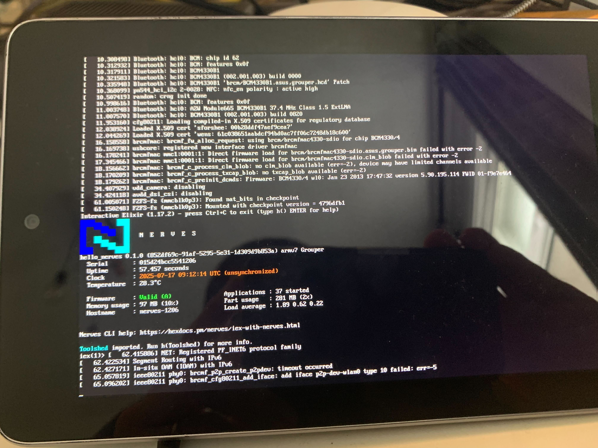

# Nexus 7 (Grouper)

This is the base Nerves System configuration for the Grouper version of the Nexus 7 (E1565).



| Feature              | Description                                                       |
| -------------------- | ----------------------------------------------------------------- |
| CPU                  | 4x1.2 Ghz Tegra 3 T30L (ARMv7)                        |
| GPU                  | 416 MHz twelve-core Nvidia GeForce ULP Mhz                                 |
| Memory               | 1 GB DDR3L RAM                                                   |
| Storage              | eMMC 16 GB partition                                 |
| Linux kernel         | 6.12.5 linux-grate mainline fork                                |
| IEx terminal         | Built-in screen or USB keyboard                                   |
| GPIO, I2C, SPI       | Limited (led, vibration motor, but no external capabilities)      |
| ADC                  | No                                                                |
| PWM                  | No                                                                |
| UART                 | Not trivial                                                 |
| Display              | 7" IPS LCD 1280x800px ppi                                 |
| Camera               | Yes but not supported                                             |
| Ethernet             | No                                                                |
| WiFi                 | Yes                                                               |
| Bluetooth            | Yes, but no Elixir support [See Bluetooth](#bluetooth)            |
| Audio                | Yes through Alsa UCM                                             |
| Modem                | No |

## Using

The most common way of using this Nerves System is create a project with `mix
nerves.new`

You then need to add the following to your `mix.exs`

```elixir
{:nerves_system_grouper,
  git: "https://github.com/Spin42/nerves_system_grouper",
  runtime: false,
  targets: :nerves_system_grouper,
  nerves: [compile: true] }
```

Now, set your MIX_TARGET with `MIX_TARGET=nerves_system_grouper`. See the [Getting started
guide](https://hexdocs.pm/nerves/getting-started.html#creating-a-new-nerves-app)
for more information.

If you need custom modifications to this system for your device, clone this
repository and update as described in [Making custom
systems](https://hexdocs.pm/nerves/customizing-systems.html).

## Flashing your firmware for the first time

### Replace stock bootloader with u-boot

This is the most complicated step, you will need to first extract your Secure Boot Key using [fusee-tools](https://gitlab.com/grate-driver/fusee-tools). For this, you will need to set your device in APX mode.

To set your device in APX mode, open the case so you can access the battery connector. Disconnect the battery, then plug your device to your computer via USB and it should show up in your `dmesg` mentionning `APX`. Then, reconnect the battery.

Now, you should just be able to execute the following command and you'll get your SBK.

```
./dump_sbk.sh -s T30
```

Copy paste it somewhere. You will need it to sign your `u-boot` bootloader later on.

You can now follow the steps in the [u-boot official documentation](https://docs.u-boot.org/en/latest/board/asus/grouper.html) to build it and flash it.

You should be able to restart your device. To access the boot menu, press the Volume down while powering on the device.

You can now set the device in UMS (USB Mass Storage) mode, and it means you can just use `mix firmware && mix burn` afterwards since it appears as an external device.

## Wifi

It should work out of the box, simply configure it in your firmware config or using:

`VintageNetWiFi.quick_configure("my_access_point", "secret_passphrase")`

over SSH.

## Bluetooth

Bluetooth is supported through the BlueZ stack. This requires to start dbus and bluetoothd in an Elixir application. More Elixir testing is required.
